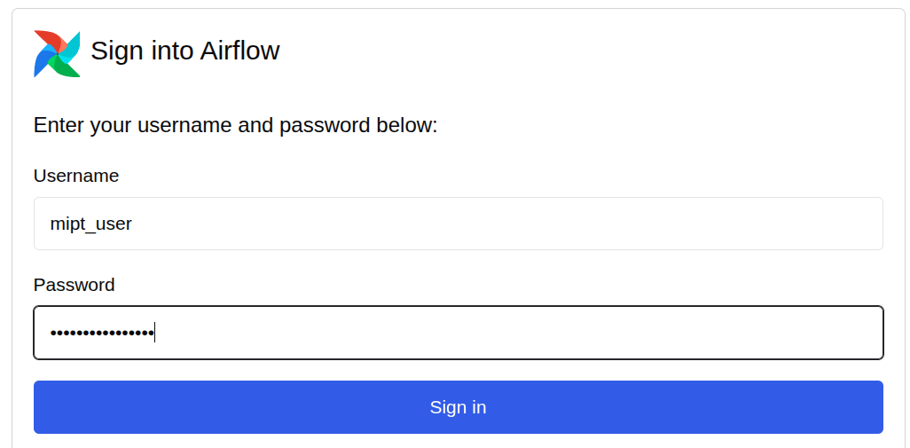
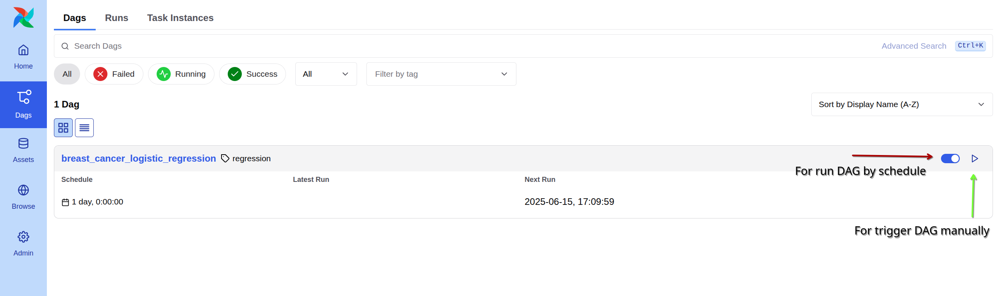
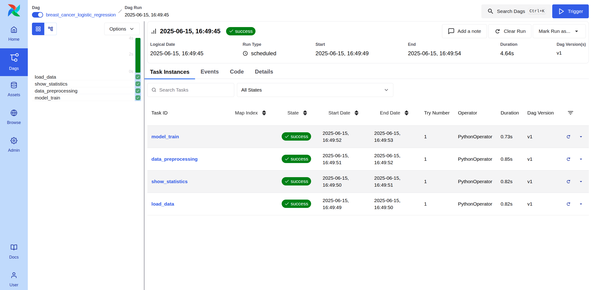

# Экзаминационное задание по предмету инжениринг данных MIPT

В данном задании необходимо построить систему полного ETL процесса и процесса обучения модели логистической регрессии при помощи системы для автоматической оркестрации пайплайнов Airflow на примере набора данных о раке груди. Данная работа показывает умение запускать и полностью настраивать автоматизированный процесс для полного цикла разработки ML модели. Данные умения будут полезны при написании выпускной квалификационной работы а так же на рабочих проектах.

## Планирования пайплайна

Мы работаем со стандартным набором данных с данными о раке груди. В данных содержатся показатели полученные из рентгеновских снимков. В данной работе необходимо составить модель логистической регрессии (модель бинарной классификации) для классификации доброкачественных и злокачественных опухолей груди.

При работе с данными мы составим следующий пайплайн:
1. Загрузка данных с спользованием библиотечной функции `scikit-learn`
2. Вывод основных статистик данных
3. Очистка и предобработка данных
4. Обучение модели и сохранение артефактов


Из диаграммы выше видно, что пайплайн линейный и каждый этап пайплайна зависит от предыдущего.

## Разработка ETL-компонентов

Пайплайн организован в виде ETL скриптов находящихся в директории `./etl`.

> `data_load.py` - скрипт содержит функцию для загрузки датасета с использованием функции `load_breast_cancer` из библиотеки `scikit-learn`. Это наименее трудозатратный и наиболее надёжный способ загрузить эти данные.
>
> `show_statistics.py` - скрипт содержит функцию для логирования основных статистик датасета. Логи сохраняются как для `airflow` так и для `local` запуска.
>
> `data_preprocessing.py` - скрипт содержит функцию для препроцессинга данных. Производится стандартизация данных, разбиение на train и test выборку а так же удаление пропусков.
>
> `model_train.py` - скрипт содержит функцию в которой производится обучение модели, инференс на тестовых данных, получение метрик и сохрание артефактов обучения (полученные метрики, модель в формате pickle, предсказанные данные для train выборки)A.

## Установка, зависимости и использование
Основными зависимостями являются `python==3.12` и установленная утилита `Make`

Для запуска рекомендуется создать отдельное виртуальное окружение
```
python -m venv .venv
source .venv/bin/activate
```

Все основные зависимости указаны в файле `requirements.txt`. Для быстрой установки можно воспользоваться командой
```
make install
```
в данной команде уже указаны все необходимые зависимости и `constraints` для установки необходимых библиотек и airflow.

### Использование

Запустить пайплан можно двумя способами:
1. `make run_airflow` - при этом происходит `standalone` запуск `airflow` в текущей директории.
2. `make run_local` - происходит запуск скрипта `pipeline.py` в котором производятся все необходимые настройки и последовательный запуск всех элементов пайплайна (из директории `./etl`).

## Оркестрация пайплайна с помощью Airflow

В директории `./dags` хранится файл с DAG пайплайна (`breast_cancer_logistic_regression`). Как описывалось выше в данном пайплайне четыре задачи, которые линейно зависят одна от другой: `load_data -> show_statistics -> data_preprocessing -> model_train`.

Запустить работу пайплайна можно путём запуска `airflow standalone` (команда `make run_airflow`). Далее залогинится под выбранным пользователем (см. упоминание про [авторизацию в Airflow](#авторизация-в-airflow)).

Далее в меню с DAG'ами запустить работу DAG'а по расписанию или запустить исполнение дага вручную для единственного запуска:


Как при локальном так и при запуске через `airflow` настроено логирование задач в директорию `./logs`. Лог каждого запуска сохраняется отдельно в поддерикторию с уникальным именем этой директории.

Пример дерева дерикторий с логами после трёх запусков:
```
 logs
├──  dag_processor
│   ├──  2025-06-15
│   │   └──  dags-folder
│   │       └──  breast_cancer_regression.py.log
│   └──  latest ⇒ 2025-06-15
└──  dag_id=breast_cancer_logistic_regression
    ├──  run_id=manual__2025-06-15T13:57:26.158746+00:00
    │   ├──  task_id=load_data
    │   │   └──  attempt=1.log
    │   ├──  task_id=show_statistics
    │   │   └──  attempt=1.log
    │   ├──  task_id=data_preprocessing
    │   │   └──  attempt=1.log
    │   └──  task_id=model_train
    │       └──  attempt=1.log
    ├──  run_id=scheduled__2025-06-15T13:56:53.238653+00:00
    │   ├──  task_id=load_data
    │   │   └──  attempt=1.log
    │   ├──  task_id=show_statistics
    │   │   └──  attempt=1.log
    │   ├──  task_id=data_preprocessing
    │   │   └──  attempt=1.log
    │   └──  task_id=model_train
    │       └──  attempt=1.log
    ├──  run_id=manual__2025-06-15T13:57:27.844756+00:00
    │   ├──  task_id=load_data
    │   │   └──  attempt=1.log
    │   ├──  task_id=show_statistics
    │   │   └──  attempt=1.log
    │   ├──  task_id=data_preprocessing
    │   │   └──  attempt=1.log
    │   └──  task_id=model_train
    │       └──  attempt=1.log
    └──  run_id=manual__2025-06-15T13:57:18.971392+00:00
        ├──  task_id=load_data
        │   └──  attempt=1.log
        ├──  task_id=show_statistics
        │   └──  attempt=1.log
        ├──  task_id=data_preprocessing
        │   └──  attempt=1.log
        └──  task_id=model_train
            └──  attempt=1.log
```

## Сохранение результатов на локальном диске

Все артефакты (результаты работы пайплайнов) сохраняются в директорию `./results`. Артефакты каждого запуска сохраняются в отдельную поддиректорию каждого запуска, как локального так и с использованием airflow. Ниже представлено примерное дерево директорий и файлов в них после нескольких запусков:
```
 results
├──  run_id=manual__2025-06-15T13:57:26.158746+00:00
│   ├──  breast_cancer.csv
│   ├──  metrics.json
│   ├──  X_scaled.npy
│   ├──  X_train.npy
│   ├──  X_test.npy
│   ├──  y_train.npy
│   ├──  y_test.npy
│   ├──  y_pred.npy
│   └──  logistic_regression.pickle
├──  run_id=scheduled__2025-06-15T13:56:53.238653+00:00
│   ├──  breast_cancer.csv
│   ├──  metrics.json
│   ├──  X_scaled.npy
│   ├──  X_train.npy
│   ├──  X_test.npy
│   ├──  y_train.npy
│   ├──  y_test.npy
│   ├──  y_pred.npy
│   └──  logistic_regression.pickle
├──  run_id=manual__2025-06-15T13:57:27.844756+00:00
│   ├──  breast_cancer.csv
│   ├──  metrics.json
│   ├──  X_scaled.npy
│   ├──  X_train.npy
│   ├──  X_test.npy
│   ├──  y_train.npy
│   ├──  y_test.npy
│   ├──  y_pred.npy
│   └──  logistic_regression.pickle
└──  run_id=manual__2025-06-15T13:57:18.971392+00:00
    ├──  breast_cancer.csv
    ├──  metrics.json
    ├──  X_scaled.npy
    ├──  X_train.npy
    ├──  X_test.npy
    ├──  y_train.npy
    ├──  y_test.npy
    ├──  y_pred.npy
    └──  logistic_regression.pickle
```

## Авторизация в Airflow

Для авторизации используется [SimpleAuthManager](https://airflow.apache.org/docs/apache-airflow/3.0.2/core-concepts/auth-manager/simple/index.html#simple-auth-manager). В файле с настройками airflow: `airflow.cfg` указано два пользователя: admin с admin ролью и mipt_user с ролью user. При первом запуске airflow эти пользователи создадутся автоматически и пароли для этих пользователей будут сгенерированы автоматически и сохраняться в файле `passwords.json`. Используя указанные в этом файле данные можно авторизоваться в систему с соответствующей ролью.

## Анализ ошибок и устойчивости

Для увеличении прозрачности процесса было настроено логирование (см. описание выше) каждого этапа пайплайна. Весь функционал разбит по модулям, что должно привести к улучшению качества кода и большей поддерживаемости кода.

В случае падения первой задачи пайплайна (загрузка данных) - данная задача будет запущена заново с интервалом в 15 секунд. Это сделано для того, что бы пробовать получить данные заново, в случае временных проблем на сервере. В остальных задачах, при наличии данных, ошибок быть не должно.

В случае если источник данных предоставит невалидные данные - тогда весь пайплайн даст сбой, что кажется правильным поведением в этой ситуации, т.к. при невалидных данных - работа всей остальной логики не представляется возможной.

Для реализации дальнейших пайплайнов - необходимо будет подходить к обработке ошибок соответственно логике пайплайно. Если некоторые этапы могут быть пропущено из-за ошибки, то нужно будет настроить весь DAG таким образом, что бы последующие задачи, которые не зависят от предыдущих этапов или зависят не строго - могли продолжать исполняться. Все ошибки в пайплайнах логировать и возможно настроить `on_retry_callback` для оповещения дежурной команды, например через имейл или `prometheus` метрики.

## Дальнейшее развитие

1. Настройка авторизации пользователей через Google OAuth
2. Сохранение логов и артефактов в S3-like хранилище. Google Cloud Storage подходит идеально для этого.
3. Добавление пайплайнов для других задач.

## Снимок экрана работающего пайплайна

